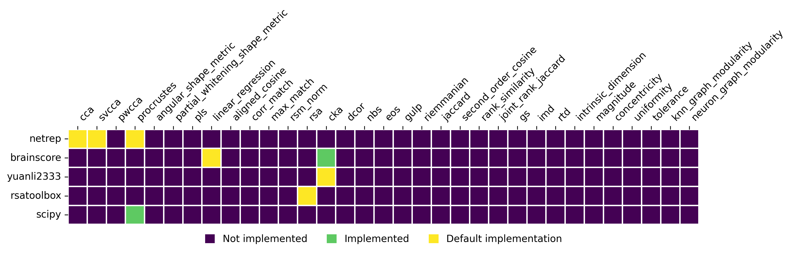

# Similarity Measures Repository

<!--  -->

    
Aggregate existing implementations of similarity measures into a single python package.

No measure is re-implemented here! Leverage only existing implementations.


## Installation

 ```
 pip clone https://github.com/nacloos/similarity-measures.git
 cd similarity-measures
 pip install -e .
 ```

TODO: does it work?
```
pip install git+https://github.com/nacloos/similarity-measures.git
```

## Usage

```python
import similarity

metric = similarity.make("cca")
```

## Organization of the repository

## Why use CUE instead of plain python?
Can easily generate a json config describing the config

Why cue language? Can use schema to validate config. Show example of adding a metric that doesn't have a card

## Adding an implementation of an existing metric
* create a folder in `similarity/backend`
* create a `requirements.txt` file with the dependencies of the backend. Optionally add a comment with the link to the installation instructions (e.g. in the README of the backend).


### Adding a new metric
(Or "Registering a new implementation")

Can only add an metric implementation for which there exists a card. Otherwise, create a card first.

Have to only modify the backend folder to add a new backend.
Create a folder for your backend. Create a cue file with the backend package.
Add an import for your backend and add the id/name of the backend in `backends.cue`


Import backend in `similarity/backend/backends.cue`
Add a new line in the import statement:
```
{backend_id} "github.com/similarity/backend/{backend_folder}:backend"
```
Add an entry to `#backends`

### Adding a new benchmark
Either copy paste code
* link to commit from which the code was copied
or put the code in a python package and link to it


### Adding an new implementation of an existing metric

