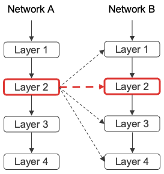
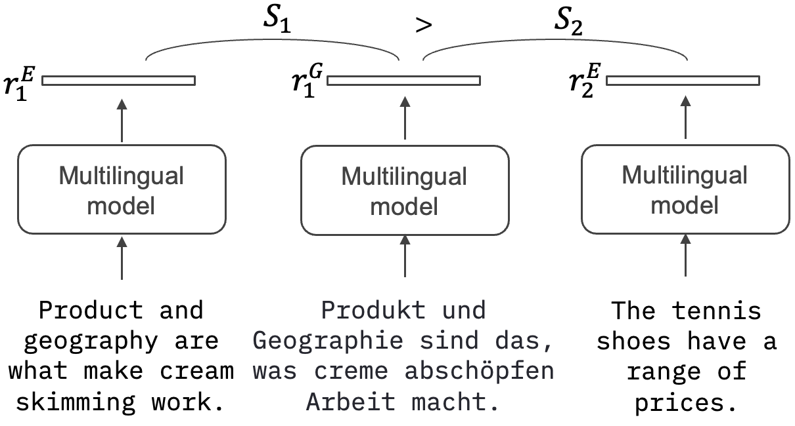
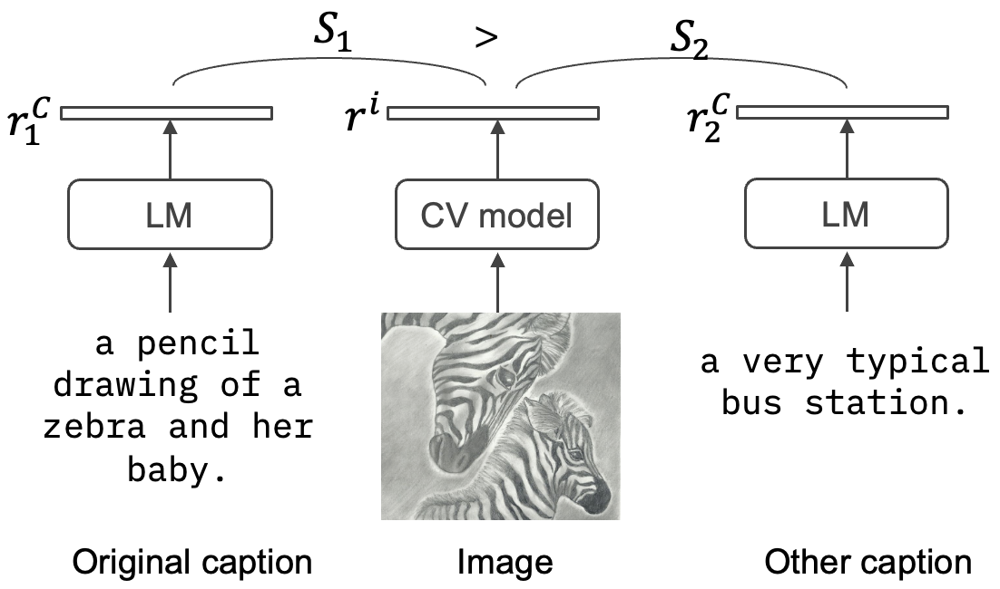

# ContraSim -- A Similarity Measure Based on Contrastive Learning

Code for reproducing results from the paper [ContraSim -- A Similarity Measure Based on Contrastive Learning](https://arxiv.org/abs/2303.16992).

## Dependencies Setup

Install the required libraries by running `pip install -r requirements.txt`.

## Layer prediction benchmark


Run `python layer_prediction.py -dataset DATASET -sim_measure SIM_MEASURE`. 
This will run the layer prediction benchmark on dataset DATASET with SIM_MEAURE.
- DATASET can be ptb_text_only or wikitext.
- SIM_MEASURE can be one of: CCA, CKA, DeepDot, DeepCKA, contrastive, svcca, contrastive_dis, Dot and Norm.
- In case you want to run all similarity measures at a single run - pass argument `-do_all`

## Multilingual benchmark


Run `python multilingual_benchmark.py -sim_measure SIM_MEASURE -faiss FAISS` . 
This will run the multilnigual benchmark with SIM_MEAURE. If FAISS is True, evaluation will be performed using faiss sampling, otherwise ransom sampling will be used.
- SIM_MEASURE can be one of: CKA, DeepDot, DeepCKA, contrastive, contrastive_dis, Dot and Norm.
- In case you want to run all similarity measures at a single run - pass argument `-do_all`

## Image caption benchmark


Run `python image_caption_benchmark.py` . 
This will run the image caption benchmark using 4 different model pair (as specified in the paper).

Code used for [CKA](https://github.com/google-research/google-research/tree/master/representation_similarity), [CCA](https://github.com/google/svcca) and [contrastive learning loss](https://github.com/HobbitLong/SupContrast) is based on publicly available code in the linked repos.

## References and Acknowledgements
```
@article{rahamim2023contrasim,
      title={ContraSim -- A Similarity Measure Based on Contrastive Learning}, 
      author={Adir Rahamim and Yonatan Belinkov},
      journal={arXiv:2303.16992},
      year={2023},
}
```
